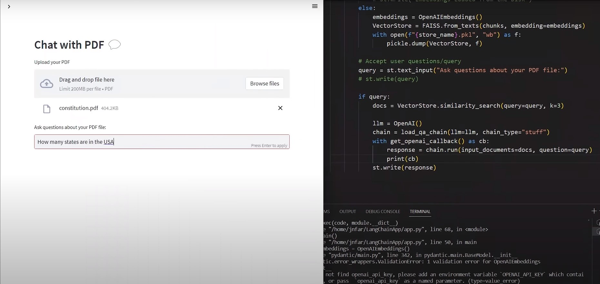

**Project Title: PDF Summarizer**

**Overview:**
The PDF Summarizer project aims to develop a tool that extracts key information from PDF documents and generates concise summaries, providing users with a quick overview of the document's content. This tool can be particularly useful for individuals who need to quickly grasp the main points of lengthy documents without reading them in their entirety.

**Key Features:**
1. **PDF Parsing:** The tool utilizes PDF parsing techniques to extract text content from PDF documents.
2. **Text Preprocessing:** The extracted text undergoes preprocessing steps such as tokenization, stop word removal, and stemming to prepare it for summarization.
3. **Summarization Techniques:** Various text summarization algorithms, such as extractive or abstractive summarization, are implemented to condense the extracted text into shorter summaries.
4. **User Interface:** The project includes a user-friendly interface, allowing users to upload PDF documents and view the generated summaries.
5. **Customization:** Users may have options to customize the summarization process, such as selecting the desired length of the summary or specifying key topics of interest.

**Potential Use Cases:**
- Academic Research: Researchers can use the PDF Summarizer to quickly review research papers and identify relevant studies.
- Business Reports: Professionals can utilize the tool to extract insights from lengthy business reports or financial documents.
- Educational Purposes: Students can benefit from summarizing textbooks or lecture notes to grasp essential concepts efficiently.

**Future Enhancements:**
- Integration with Cloud Services: The tool could be integrated with cloud services to support scalable processing of large PDF collections.
- Advanced Summarization Techniques: Implementation of advanced algorithms, such as deep learning-based abstractive summarization models, for more sophisticated summarization capabilities.
- Natural Language Understanding: Incorporating natural language understanding techniques to improve the tool's ability to identify key information and context.

**How to Run in your system**

Download neccessary files: pypdf2,python-dotenv, streamlit, langchain, streamlit_extras
Run the pdf.py file
PUT your OPENAI api key in .env file
run the streamlit app using command Streamlit run pdf.py